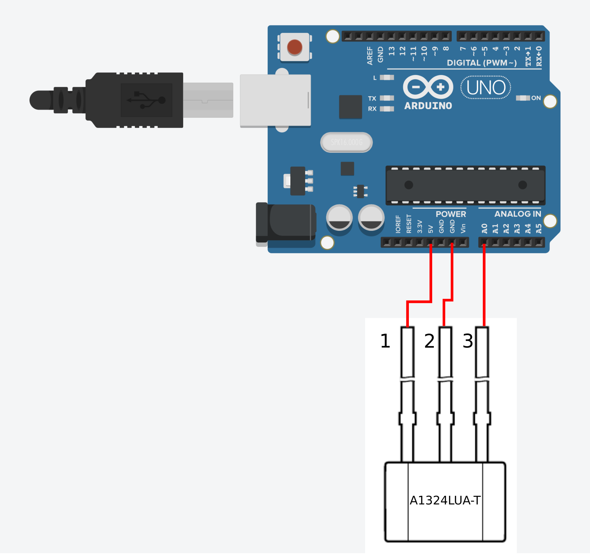
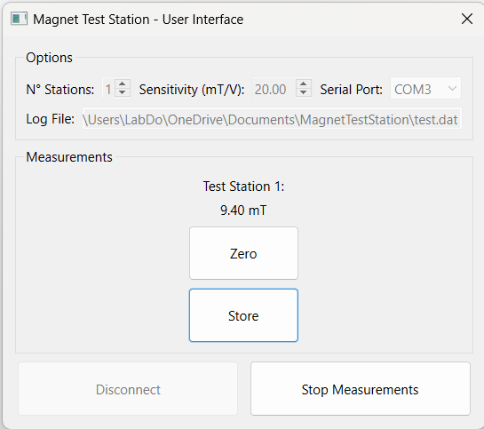

# Magnet Test Station
A test station for assessing the polarization of small permanent magnets and their correct magnetization 

## Required Material 
- Arduino board
- A1324LUA-T Hall sensor
- 3D Printer for printing the frame
- Python 3 with the following libraries installed:
    - PyQt6
    - numpy
    - pyserial

## Description
- The CAD models of the frame and of different spacers are collected in the *CAD-Model* folder. The following spacers are available:
    - **Spacer_A0**: Optimized for N52 12 x 12 x 12 mm<sup>3</sup> cubic permanent magnets
    - **Spacer_A1**: Optimized for N52 12 x 12 x 12 mm<sup>3</sup> cubic permanent magnets with a guide to the magnet at the centre
    - **Spacer_B0**: Optimized for N52 50 x 12 x 12 mm<sup>3</sup> permanent magnets with a magnetization alligned along one of the short sides
- The Python scripts used to interface with the Arduino board are collected inside the *PythonScript* folder. 
- The code to be uploaded into the Arduino board can be found in the *ArduinoScript* folder

## Usage

1. Connect the Arduino board to a USB port
   
2. Prepare all the necessary connections. The following picture shows the connection of a single Hall sensor to the A0 analog pin of Arduino. Other Hall sensors can be connected to the other analog pins. At the present stage, the User Interface is designed to manage a maximum number of Hall sensors equal to four.



3. Add the analog pin names to which the Hall sensors are connected into the short int array *pins* inside the Arduino sketch code "ArduinoScript/magnetTestStation.ino"
   ```cpp
   short pins[] = {A0};
   ```  
Upload the Arduino sketch into the Arduino board.

4. Run the Python script *mainInterface.py* in order to open the Main User Interface. Select the number of Hall sensor that have to be read, the sensors sensitivity, the Arduino board serial port and the log file name. Press the *Connect* button in order to establish a connection with the Arduino board. When ready, press the *Start Measurements* button to start the measuring process. During the measurement process, it is possible to store the measured data into the log file by pressing the *Store* button. Finally it is possible to set a zero by pressing the *Zero* button.




